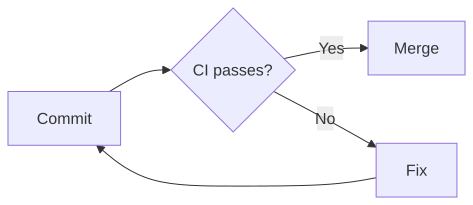
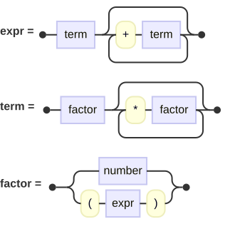

# dewasm-merman

[](https://github.com/dewasm/ruby-merman/actions/workflows/test.yml)
[](https://rubygems.org/gems/dewasm-merman)

**Mermaid** diagrams rendered in **pure Ruby**.

The renderer is [merman](https://github.com/Latias94/merman), a headless Rust implementation of Mermaid, compiled to `wasm32-wasip1` and converted to Ruby source by [dewasm](https://github.com/dewasm/dewasm).
There is *no browser*, *no native extension*, and *no wasm runtime* involved: the gem is Ruby code that a stock `ruby` executes.

The gem is built from merman `0.8.0-alpha.6` on crates.io.
Two cargo features are enabled: `complete-svg-elk` and `ascii`.

## Install

```console
$ gem install dewasm-merman
```

Or in `Gemfile`:

```ruby
gem "dewasm-merman"
```

Ruby 3.4 or newer is required, because the converted module stores WebAssembly linear memory in an `IO::Buffer`.

## Usage

```ruby
require "dewasm/merman"

svg = Dewasm::Merman.render(<<~MERMAID)
  flowchart LR
    A[Commit] --> B{CI passes?}
    B -->|Yes| C[Merge]
    B -->|No| D[Fix]
    D --> A
MERMAID

File.write("flowchart.svg", svg)
```



Railroad grammar diagrams render the same way:

```ruby
svg = Dewasm::Merman.render(<<~MERMAID)
  railroad-ebnf-beta
  expr = term , { "+" , term } ;
  term = factor , { "*" , factor } ;
  factor = number | "(" , expr , ")" ;
MERMAID
```



Terminal text instead of SVG:

```ruby
puts Dewasm::Merman.render(<<~MERMAID, format: :unicode)
  flowchart LR
    A[Start] --> B[Done]
MERMAID
```

```
┌───────┐     ┌──────┐
│       │     │      │
│ Start ├────►│ Done │
│       │     │      │
└───────┘     └──────┘
```

```ruby
puts Dewasm::Merman.render(<<~MERMAID, format: :ascii)
  flowchart TD
    A[Start] --> B[Done]
MERMAID
```

```
+-------+
|       |
| Start |
|       |
+-------+
    |
    |
    |
    |
    v
+-------+
|       |
|  Done |
|       |
+-------+
```

## Diagram types

The enabled features are merman's full SVG capability set: the Cytoscape and ELK layout engines and the RaTeX math backend are all compiled in, so no diagram type and no `layout:` or `$$...$$` construct is turned off by the feature selection.
The `:ascii` and `:unicode` formats cover the subset merman renders as terminal text; asking them for a type without a check in the ASCII column raises `Dewasm::Merman::Error`.
Each row names the keyword the diagram text opens with.

<!-- diagram-types:begin -->
| Diagram type | SVG | ASCII |
| --- | :-: | :-: |
| `architecture-beta` | ✓ | — |
| `block-beta` | ✓ | — |
| `C4Context`, `C4Container`, `C4Component`, `C4Dynamic`, `C4Deployment` | ✓ | — |
| `classDiagram` | ✓ | ✓ |
| `cynefin-beta` | ✓ | — |
| `erDiagram` | ✓ | ✓ |
| `eventmodeling` | ✓ | — |
| `flowchart` | ✓ | ✓ |
| `gantt` | ✓ | ✓ |
| `gitGraph` | ✓ | ✓ |
| `info` | ✓ | — |
| `ishikawa-beta` | ✓ | — |
| `journey` | ✓ | ✓ |
| `kanban` | ✓ | ✓ |
| `mindmap` | ✓ | ✓ |
| `packet-beta` | ✓ | ✓ |
| `pie` | ✓ | — |
| `quadrantChart` | ✓ | — |
| `radar-beta` | ✓ | — |
| `railroad-beta`, `railroad-ebnf-beta`, `railroad-abnf-beta`, `railroad-peg-beta` | ✓ | — |
| `requirementDiagram` | ✓ | — |
| `sankey-beta` | ✓ | — |
| `sequenceDiagram` | ✓ | ✓ |
| `stateDiagram-v2` | ✓ | ✓ |
| `timeline` | ✓ | ✓ |
| `treemap-beta` | ✓ | — |
| `treeView-beta` | ✓ | ✓ |
| `venn-beta` | ✓ | — |
| `wardley-beta` | ✓ | — |
| `xychart-beta` | ✓ | ✓ |
| `zenuml` | ✓ | — |
<!-- diagram-types:end -->

Diagram metadata, mirroring Mermaid's `mermaidAPI.parse()` return shape:

```ruby
metadata = Dewasm::Merman.parse_metadata(<<~MERMAID)
  ---
  title: My Chart
  ---
  pie title Pets
    "Dogs" : 3
MERMAID

metadata["diagram_type"]               # => "pie"
metadata["title"]                      # => "My Chart"
metadata["config"]                     # => {} (front-matter and directive overrides)
metadata["effective_config"]["theme"]  # => "default"
```

Mermaid site configuration is a Hash, serialized to JSON and applied as merman's site config:

```ruby
svg = Dewasm::Merman.render(<<~MERMAID, site_config: { "theme" => "dark" })
  flowchart TD
    A --> B
MERMAID
```

## API

`render` turns the given diagram text into one output format, named the way merman-cli's `render --format` names it; `parse_metadata` reads diagram metadata without rendering.

| Ruby | merman |
| --- | --- |
| `Dewasm::Merman.render(text, format:, **options)` | `Renderer::render` with the format's `RenderRequest` |
| `Dewasm::Merman.parse_metadata(text, **options)` | `Engine::parse_metadata_sync` |

The keywords follow merman-cli's `render` command: an option that has a CLI flag carries the flag's name, and an option the CLI does not name carries its merman field name.

`format:` takes the merman-cli `--format` values compiled into this gem: `:svg` (the default), and `:ascii` or `:unicode` for terminal text starting from that charset's `AsciiRenderOptions` constructor.

Options on `render` for every format:

| Option | Default | merman-cli / merman |
| --- | --- | --- |
| `site_config:` | `nil` | `Engine#with_site_config`, a Hash carried as JSON |
| `suppress_errors:` | `nil` | `--suppress-errors`: `true` emits an error diagram instead of failing on parse errors; `nil` keeps merman's own default |
| `resource_profile:` | `nil` | `--resource-profile`: `:interactive`, `:constrained`, `:trusted_native`, or `:unbounded_for_trusted_input`, resolving every resource policy of the operation from one profile |
| `resource_limits:` | `nil` | `--resource-limit`: a Hash from merman's stable limit ids (as symbols, `max_grid_cells:`, `max_source_bytes:`, ...) to values, applied over the profile |
| `fixed_today:` | `nil` | `--fixed-today`, a `Date` |
| `fixed_local_offset_minutes:` | `nil` | `--fixed-local-offset-minutes` |
| `random:` | `Random` | the source of the render's hash seed |

Options on `render(format: :svg)`:

| Option | Default | merman-cli / merman |
| --- | --- | --- |
| `pipeline:` | `nil` | `--svg-pipeline`, an `SvgPipeline` preset: `:parity` (validated Mermaid-parity output), `:readable` (`<text>` fallbacks for `<foreignObject>` labels), or `:resvg_safe` (restricted to what usvg, resvg, and raster converters accept); `nil` keeps merman's default of applying none |
| `svg_id:` | `nil` | `--svg-id`, the root SVG id and internal marker prefix |
| `viewbox_padding:` | merman's default | `SvgRenderOptions#viewbox_padding` |

Options on `render(format: :ascii)` and `render(format: :unicode)`, each with merman's default:

- `charset:` (`:unicode` or `:ascii`), the `--ascii-charset` override of the format's charset,
- `width_profile:` (`:unicode` or `:cjk`), the `--ascii-width-profile` display-width rule,
- `layout_profile:` (`:canonical` or `:compact`), the `--ascii-layout-profile` density,
- `direction:` (`:left_right` or `:top_down`), the `--ascii-direction` default,
- `color:` (`:plain`, `:ansi16`, `:ansi256`, `:true_color`, `:html`), the `--ascii-color` mode,
- `color_theme:` (`:light` or `:dark`),
- `flowchart_node_label_wrap_width:`, the `--ascii-flowchart-node-label-wrap-width` wrap point,
- `sequence_mirror_actors:`, the `--sequence-mirror-actors` toggle,
- `xychart_vertical_plot_height:`, `xychart_category_band_width:`, `xychart_horizontal_plot_width:`, the `--xychart-*` sizes,
- `max_width:`, `overflow:` (`:allow`, `:fallback`, or `:error`), and `trim_trailing_spaces:`, the `--ascii-max-width`, `--ascii-overflow`, and `--ascii-trim-trailing-spaces` viewport controls,
- `box_border_padding:`, `graph_padding_x:`, `graph_padding_y:`,
- `sequence_participant_spacing:`, `sequence_message_spacing:`, `sequence_self_message_width:`,
- `relation_summary_diagnostics:`.

`parse_metadata` takes `site_config:` and `random:`.

Errors from merman are raised as `Dewasm::Merman::Error` carrying merman's message, for example `Diagram parse error (flowchart-v2): Unexpected character at 15` or `` ASCII rendering does not support diagram type `pie` ``.

## How it is built

`wasm/` is a small Rust crate that wraps merman behind a flat wasm ABI.
It is compiled to `wasm32-wasip1`, post-processed with `wasm-opt`, and converted to Ruby by `dewasm`.

Neither build product is committed: `lib/dewasm/merman/wasm_module.rb` and `lib/dewasm/merman/snapshot.bin.gz` are produced by the build and shipped in the gem.

## Snapshot

merman spends a few seconds initializing internal data before its first render.
The gem avoids that cost by computing the initialized memory ahead of time and shipping it as `snapshot.bin.gz`, which each render restores instead of running the initialization.

## Size, memory, and speed

<!-- measurements:begin -->
Measured on macOS 26.6.2, Apple M1 Pro, Ruby 4.0.4, rendering a two-node flowchart.

| Quantity | Value |
| --- | --- |
| `wasm/merman.wasm` after `wasm-opt -Oz` | 11.3 MB |
| Generated `wasm_module.rb` | 48.8 MB |
| Shipped `snapshot.bin.gz` | 1.3 MB |
| Packaged `.gem` | 8.4 MB |
| `require "dewasm/merman"` | 2.6 s |
| Resident memory after `require` | 1090.2 MB |
| One module instantiation | 17 ms |
| `render` to SVG, flowchart | 51 ms |
| `render` to SVG, sequence diagram | 55 ms |
| `render` to SVG, railroad diagram | 50 ms |
| `render` to terminal text, flowchart | 110 ms |
| `parse_metadata` | 78 ms |
<!-- measurements:end -->

The numbers move with the pinned merman version and with the dewasm revision used to generate the module, so rerun `rake measure` after changing either.

> [!IMPORTANT]
> Loading this gem costs **~1 GB of resident memory** and several seconds.
>
> If those sizes or that resident memory rule this gem out, [dewasm-pozeiden](https://github.com/dewasm/ruby-pozeiden) is a much smaller Mermaid renderer, but covers fewer diagram types.

## Tasks

<details>

The Rakefile drives everything, and each task depends on the ones before it, so running a later task runs what it needs first.
From a clean checkout `rake test` is enough; the individual tasks are useful when only one step is in question.

### `rake wasm:build`

```console
$ rake wasm:build
```

Compiles `wasm/` and post-processes it into `wasm/merman.wasm`.
It needs the `wasm32-wasip1` Rust target (`rustup target add wasm32-wasip1`) and `wasm-opt` from Binaryen.

### `rake generate`

```console
$ rake generate
```

Converts that module into the Ruby the gem ships, and captures the state snapshot that ships with it.
It needs a dewasm binary, its path in `DEWASM_BIN`.

### `rake test`

```console
$ rake test
```

Runs `test/` against the generated module and the captured snapshot.
It needs `rake generate`.

### `rake measure`

```console
$ rake measure
```

Refreshes the measurements table in `README.md` with numbers from this machine.
It needs `rake generate`, and a built gem in the checkout for the `.gem` row.

### `rake diagram_types`

```console
$ rake diagram_types
```

Rewrites the diagram type table in `README.md` from the rows the wasm module exports and a render of each row's samples.
The test suite fails when the table no longer matches what this task writes.
It needs `rake generate`.

### `rake example_svgs`

```console
$ rake example_svgs
```

Rewrites the SVG files under `examples/` from the README's example diagrams.
They are rendered with the `:resvg_safe` pipeline, whose output displays as an image without `foreignObject` support.
The test suite fails when a committed SVG no longer matches what this task writes.
It needs `rake generate`.

### `rake build`

```console
$ rake build
```

Packages the gem.
It needs `rake generate`.

### `rake clean`

```console
$ rake clean
```

Removes the build products and `wasm/target`.
It needs nothing.

</details>

## License

This repository's own code is MIT: see `LICENSE`.

merman is dual licensed under MIT or Apache-2.0, and this gem takes it under MIT: see `LICENSE-MERMAN`.
The gem also ships merman's `THIRD_PARTY_NOTICES-MERMAN.md`, upstream's inventory of the projects merman derives from (Mermaid itself among them).
That inventory covers every upstream artifact; this gem contains only the `complete-svg-elk` and `ascii` feature closure.

merman is not affiliated with or endorsed by Mermaid.
